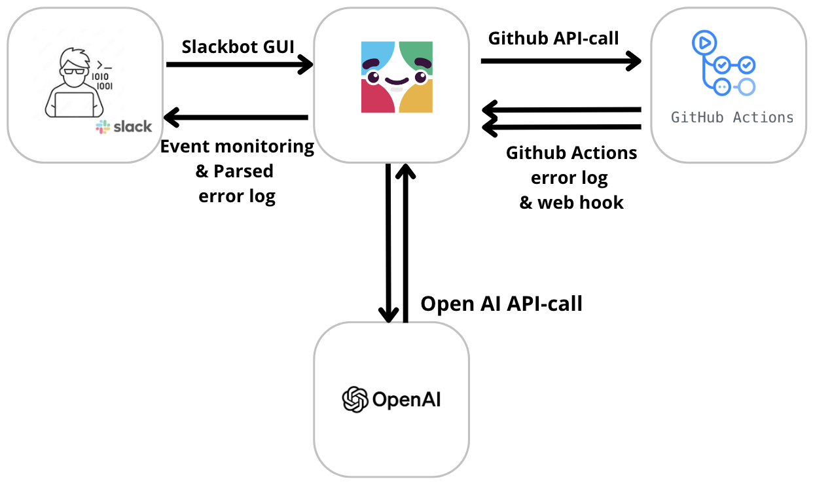

# Introduction
A crucial part of DevOps keeping the CI/CD pipeline as streamlined as possible. One way to do this is to integrate the integration and deployment of code into slack using a Slackbot GUI. This way, developers can run tests and receive structured error logs directly in slack, enabling quick communication and discussion with the rest of the team. The aim is to reduce down-time, minimize unnecessary manual tasks, and effectivize developer communication.

This tutorial will show you how to create a Slackbot which can be used to communicate with Github actions to run any action or test in your project. In this case, the project will be a simple node.js server. The result of the test and any error logs will then be returned to the chat channel and parsed into a readable and easily debuggable format.

The tutorial will show you the manual monitoring/activation of Github Actions tests. The possible use cases for the bot are however much wider. It can be changed slightly to be used for anything from automatic push/merge action messages to manual status checks. Please enjoy!

## Prerequisites:
Slack account & OpenAI API key (TA has approved)
Basic knowledge of Github & Github Actions
Basic understanding of Node.js

