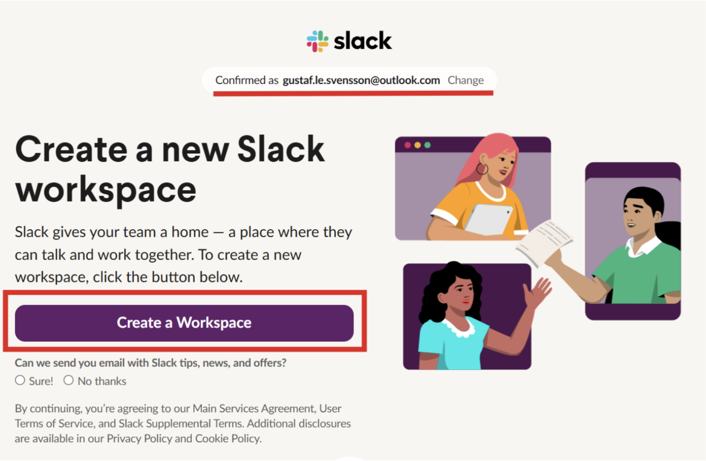
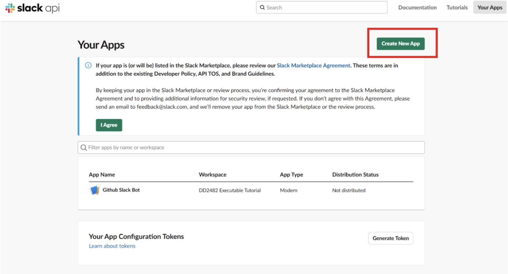
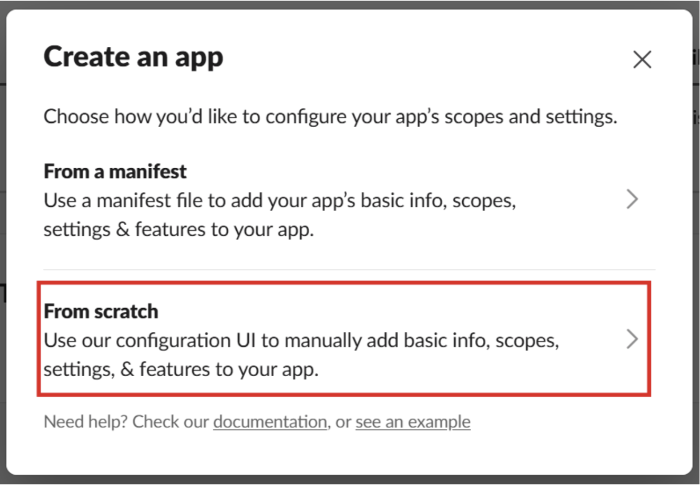

# Set up slack bot in browser:

Great job so far! Now it's time for us to get into setting up the node.js slack bot:

To start developing a slack bot you first need to create a slack workspace and app. To create a slack workspace for your bot browse to the website [https://slack.com/get-started#/landing](https://slack.com/get-started#/landing) and sign in with your chosen Slack account. Once signed in verify that your chosen account is the correct one for administrating your bot and workspace at the top of the page and click the *Create a Workspace button*.

Follow the setup, choosing a name for the workspace and creating your own profile with a name. You will be asked to invite other members to the workspace, to skip this step click the *Copy Invite Link* button and click on the text prompting *Skip this step*. Continue setting up the workspace by choosing the name of the first channel and choosing what payment plan to run the workspace on. The free plan works fine for this tutorial. When setup, the workspace should look as follows:

Note that the name of the channel #general in the image is the name I chose when setting up the workspace. You might have a different channel name. 

Once you have a slack workspace set up, go the [https://api.slack.com/apps](https://api.slack.com/apps) website to create a slack app. Once signed in with the same account as the workspace was created with, Click on the *Create New AppÄ button in the top right corner. And click on the *From scratch* option in the just shown modal.  

Choose a name for your slack app and pick **the workspace you just created**. From the possible workspaces. Finally click the button *Create App* to create your slack app.

You now have a workspace and a slack app. The next step is to give your app the required permissions, installing it in the workspace and saving the necessary secrets for our Node.js app.

Firstly, under basic information find the *Signing* secret, show it and copy it for later.

Secondly, in the right menu under **Features** find the *OAuth & Permissions section*. There, scroll down to Scopes and give the app the following OAuth scopes:

Now that we’ve given the bot OAuth scopes, we can install it in our workspace by scrolling to the top of the *OAuth & Permissions page* and clicking the *Install to [workspace name]* button:

Once clicking the button, chose a channel we want the bot to operate in - you can either choose one of existing channels or create a separate channel for the bot. 

Once the bot is installed in your chosen workspace you will be able to see the *Bot User OAuth Token* on the page where the installation was started. Copy it and save it for later. 

The last step we need to finish in the configuration of the slack app is to create an app token and enable socket mode. Under the **Settings** section on the right hand side you find a *Socket Mode* option, on that page click *Enable Socket Mode*. Since no App-level token has been created you will be prompted to create one. Give it a name and the following scopes:

When generated, copy the token and save it for later. By now the foundation for the app should be all set up and you should have the following secrets saved for our .env file:
- Slack signing secret
- Slack OAuth token
- Slack App token
