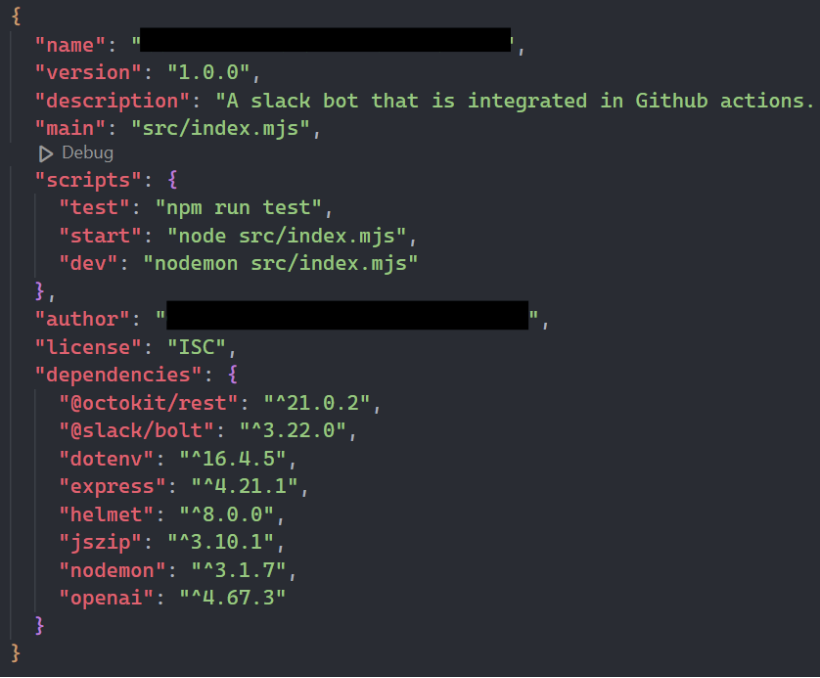

# Setup node.js application and index.mjs file

Okay, FANTASTIC job so far, we are now done with all the prep!

It's now time to set up the node application and install the needed packages. We also create more scripts that are useful for developing our node applciation.

```
cd
mkdir node-slackbot
cd node-slackbot
npm init -y
npm install @octokit/rest @slack/bolt dotenv express helmet jszip nodemon openai
sed -i 's|"main": "index.js"|"main": "src/index.mjs"|' package.json
sed -i '/"scripts": {/a \    "test": "npm run test",' package.json
sed -i '/"scripts": {/a \    "dev": "nodemon src/index.mjs",' package.json
sed -i 's|"start": "node index.js"|"start": "node src/index.mjs"|' package.json
```{{exec}}

When setup, your package.js should look like this:



Create a .env file in the root of the project and assign the following environment variables (input your saved keys from step 4.):

```
cat << 'EOF' > .env
SLACK_BOT_TOKEN = "The Slack OAuth token from step 1"
SLACK_SIGNING_SECRET = "The Slack sign in secret from step 1"
APP_TOKEN = "The Slack app token from step 1"
SLACK_PORT = 5000
EXPRESS_PORT = 4000
EOF
```{{exec}}

Create a folder called /src with a file index.mjs inside. In the top of the file add the following lines of code:

```
mkdir src
cd src
cat << 'EOF' > index.mjs
import pkg from '@slack/bolt';
import dotenv from 'dotenv';
import express from 'express';
import helmet from 'helmet';

dotenv.config();

const { App } = pkg;

const app = new App({
    token: process.env.SLACK_BOT_TOKEN,
    signingSecret: process.env.SLACK_SIGNING_SECRET,
    socketMode: true,
    appToken: process.env.APP_TOKEN
});
EOF
```{{exec}}

These lines of code imports the modules required, and init the app object. The first line after the imports **dotenv.config();** loads the environment variables from the .env file into **process.env**. The following lines creates a constant *app* that is a Slack Bolt application with the assigned secrets, communicating using the socket configured on the slack platform.

Next, setup an express app using the following lines of code:
```
echo "const expressApp = express();
expressApp.use(express.json());
expressApp.use(helmet());
" >> index.mjs
```{{exec}}

The final line of code tells the express app to use the middleware helmet which configures the HTTP headers in order to prevent certain security issues such as XSS attacks.

Finally, add the following lines of code that launches the app:

```
echo "(async () => {
    await app.start(process.env.SLACK_PORT);
    expressApp.listen(process.env.EXPRESS_PORT);
    console.log('Bot is running!');
})();
" >> index.mjs
```{{exec}}

There are two separate ports in use, one for the slack bolt app and one for the express app. The first one is for communication between the bot and slack and the second one is for the future webhook that will be called from the github action.

Now you should be able to start the app by running the following commands in the terminal:

```
npm run dev
```{{exec}}

Ones running the command, the following should be printed in the terminal showing that the bot thus far is running:
```
Bot is running!
[INFO]  socket-mode:SocketModeClient:0 Now connected to Slack
``` 

If you see the above lines in the terminal, this step is done and we have the beginning of our slack bot.

