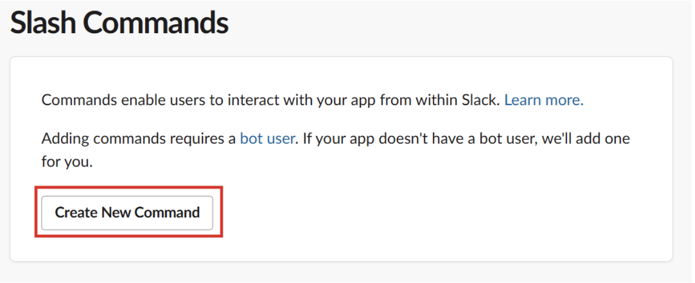
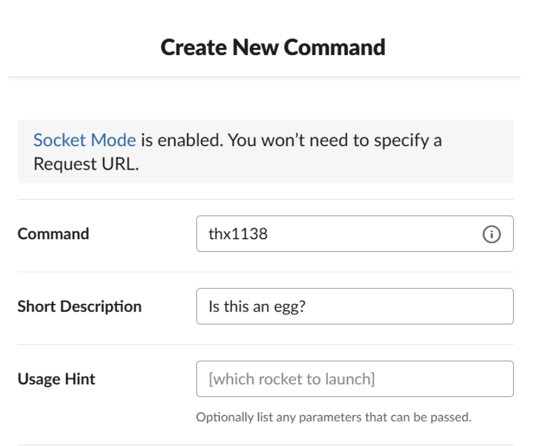

# Setting up the slash commands
At the current stage the bot can’t do anything special. The first thing that should be done is to setup some basic slash commands. These are configured in two steps - adding a slash command on the slack api platform and adding the same command and its functionality in the source code.

On the slack api platform, find the page *Slash Commands* on the right hand side. There press the button to add a slash command:



Specify the command and assign a short description of the command that will show on slack like this:



For this example we’ll create the command **/thx1138**. When the info is filled in, press the green save button in the lower right corner and the slash command is configured on the platform.

Now in the code, create the following file called commands.mjs with the following content:

```
cd
cd node-slackbot/src
cat << 'EOF' > commands.mjs
export const registerCommands = (app) => {
    app.command('/thx1138', async ({ command, ack, say }) => {
        try {
            await ack();
            await say(`The force is strong with this one.`); // Easter egg! :)
        }
        catch (error) {
            console.error(error);
        }
    });
}
EOF
```{{exec}}

The following code exports a function that gathers all slash commands in a specific place for ease of readability. For the commands to work though, the function needs to be called from the index.mjs file. So let's open that file and add the following line between the initialisations of the slack and the express app:
```
registerCommands(app);
```
(if you are lazy click below)

```
sed -i '17i\registerCommands(app);' index.mjs
```{{exec}}

The index.js file should now look like this:

```
import pkg from '@slack/bolt';
import dotenv from 'dotenv';
import { registerCommands } from './commands.mjs';
import express from 'express';
import helmet from 'helmet';
import { getActionLog } from './github-integrations/getActionLog.mjs';


dotenv.config();


const { App } = pkg;


const app = new App({
    token: process.env.SLACK_BOT_TOKEN,
    signingSecret: process.env.SLACK_SIGNING_SECRET,
    socketMode: true,
    appToken: process.env.APP_TOKEN
});


registerCommands(app);


const expressApp = express();
expressApp.use(express.json());
expressApp.use(helmet());


(async () => {
    await app.start(process.env.SLACK_PORT);
    expressApp.listen(process.env.EXPRESS_PORT);
    console.log('Bot is running!');
})();
``` 

If you start the node.js application and in slack type /thx1138 you should get the response *The force is strong with this one*. If this response is sent in slack, you are done with this step. Good job!

