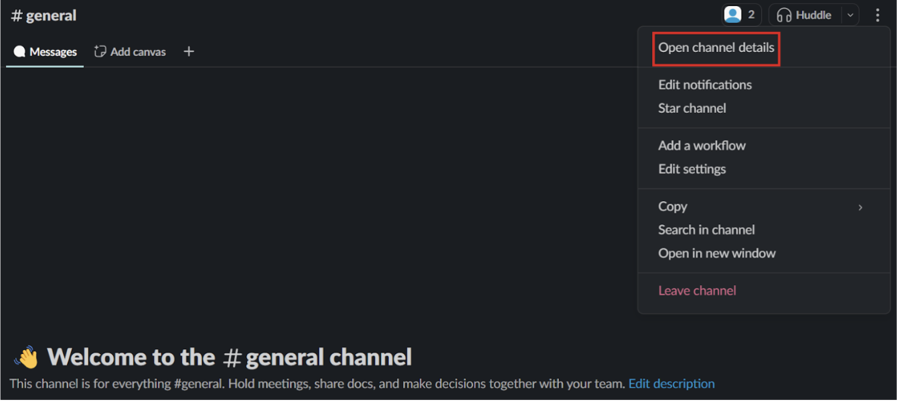
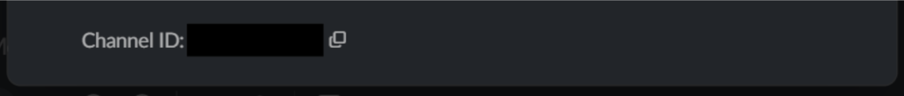

# Setup action handlers
This step will set up the action handlers for the UI. One of the steps in the action handler will be to send messages to a channel on slack. In order for this to be possible we need to export the id of the channel we want the bot to send messages in. This is done in the slack workspace by navigating to the channel, clicking the three dots in the corner and clicking the button *Open channel details*.



In the modal that opened scroll to the bottom where you find the channel id. 



Copy it and store it it in the .env file:

```
cd
cd node-slackbot
echo "SLACK_CHANNEL_ID = "Your Slack channel id"
" >> index.mjs
```{{exec}}

Next, in the top of the command.mjs file, under the import of the botUI add the following lines of code:

```
import { registerActionHandlers } from './botUI/uiActionHandlers.mjs';
```

(if you are lazy click below)

```
cd
cd node-slackbot/src
sed -i "2i\import { registerActionHandlers } from './botUI/uiActionHandlers.mjs';" commands.mjs
```{{exec}}

In the function registerCommands add the following line of code:

```
registerActionHandlers(app);
```

Next create a new file in the /botUI path called uiActionHandlers.mjs. In it add the following lines of code:

```
cd
cd node-slackbot/botUI
cat << 'EOF' > uiActionHandlers.mjs
import dotenv from 'dotenv';


dotenv.config();


export const registerActionHandlers = (app) => {
    app.action('deploy_master_action', async ({ ack, body, client }) => {
        try {
            await ack();
            client.chat.postMessage({
                channel: process.env.SLACK_CHANNEL_ID,
                text: "Deploy event triggered"
            })
        }
        catch (error) {
            console.error(error);
        }
    });


    app.action('run_tests_action', async ({ ack, body, client }) => {
        try {
            await ack();
            client.chat.postMessage({
                channel: process.env.SLACK_CHANNEL_ID,
                text: "Deploy event triggered"
            })
        }
        catch (error) {
            console.error(error);
        }
    });
};
EOF
```{{exec}} 

You see that the file exports the action listeners for the button events. Each action listener listens on one of the actions ID's specified in the earlier step. When one of the buttons is clicked the listener sends a message to slack saying that it triggered an event. If you start the server, launch the modal and click one of the buttons you should see a message being sent by the bot that the wished event just triggered. The next step is to integrate the bot with the github API.
